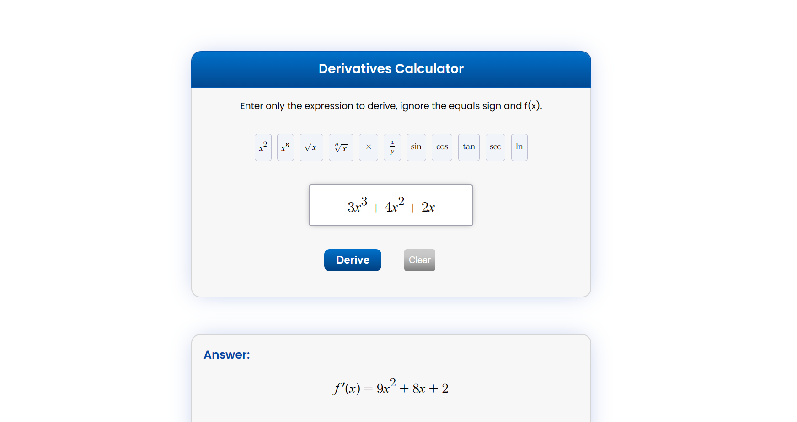

# Derivatives Calculator with LaTeX rendering

This calculator takes in an expression rendered in LaTeX and finds its derivative. A keypad is also added to include common mathematical expressions.

## Table of contents

- [Overview](#overview)
  - [Instructions](#instructions)
  - [Screenshot](#screenshot)
  - [Links](#links)
- [My process](#my-process)
  - [Built with](#built-with)
- [Author](#author)


## Overview

## Instructions
1. This app requires [MathQuill](http://mathquill.com/) to display the math input field and render LaTeX.

2. This app also requires [Nerdamer](https://nerdamer.com/) to add a math expression evaluator.

3. The expression to be differentiated can be typed in the input field and it will automatically be displayed in LaTeX

4. The keypad can be used to type in common math expressions.

5. MathQuill is used to render LaTeX expressions in each element: 

```js
MQ.StaticMath(element); 
```

### Screenshot



### Links

- Live Site URL: [https://jefferh30.github.io/Derivatives-Calculator-with-LaTeX/](https://jefferh30.github.io/Derivatives-Calculator-with-LaTeX/)

## My process

### Built with

- Semantic HTML5 markup
- CSS custom properties
- CSS flexbox
- Simple JavaScript
- MathQuill
- Nerdamer

## Author

- Website - [Jefferson Huera](https://www.neurochispas.com)
